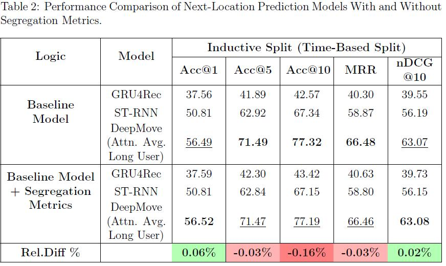
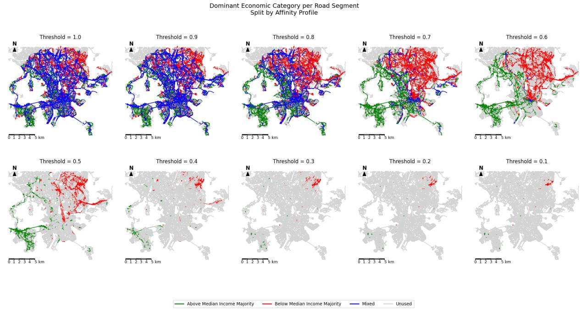

# Human Mobility in Helsinki  
## Predicting Next Locations and Exploring Spatial Segregation Patterns

  
  

---

## Overview

This project investigates whether socio-spatial segregation improves next-location prediction in large-scale human mobility data.

Using a real-world GPS dataset from Helsinki (Locomizer), the study integrates:

- Sequential deep learning models (GRU4Rec, ST-RNN, DeepMove)
- Segregation-aware behavioural features
- A Schelling-inspired route adaptation simulation on real road networks

The central question:

> Does incorporating experienced segregation meaningfully improve mobility prediction performance?

---

## Key Contributions

1. **Schelling-Inspired Simulation on Real Road Networks**  
   Instead of a traditional grid, segregation behaviour is simulated over Helsinki’s real urban road network.

2. **Segregation-Aware Feature Engineering**  
   Social exposure metrics (co-presence, economic interaction, affinity-based contact) are integrated into RNN-based models.

3. **Comparative Evaluation of Sequential Models**
   - GRU4Rec  
   - ST-RNN  
   - DeepMove (Attention-based long-term user modelling)

4. **Inductive Time-Based Evaluation Setup**  
   Models are evaluated under a time-based inductive split to test generalisation.

---

## Methodology

### Data
- Large-scale GPS mobility dataset (Helsinki)
- POI-mapped trajectories
- Economic category inference at user level

### Models
- GRU4Rec
- ST-RNN
- DeepMove (Attn. Avg. Long User)

### Evaluation Metrics
- Acc@1
- Acc@5
- Acc@10
- MRR
- nDCG@10

### Simulation
- Threshold-based route avoidance
- Dominance classification of road segments
- Mixed-edge detection
- Behavioural rerouting under exposure constraints

---

## Results Summary

While segregation-aware features provide consistent improvements across some metrics, performance gains remain modest.

Relative differences (Acc@1):
- +0.06% improvement with segregation features

The findings suggest:

- Socio-spatial context is conceptually relevant  
- Performance improvements are incremental  
- Larger gains may require architectural innovations rather than feature augmentation alone  

---

## Why This Matters

Human mobility modelling has applications in:

- Urban planning
- Transport optimisation
- Public health modelling
- Smart city systems

This research explores the intersection of:

- Social segregation dynamics  
- Sequential deep learning  
- Spatial behavioural modelling  

---

## Repository Structure
- images/ # Visualisations and result figures
- Main_code_Helsinki.ipynb # Core modelling and evaluation pipeline
- Analysis_doc_schelling.pdf # Full thesis document
- README.md

---

## Full Thesis

The full MSc thesis is available here:

[Download PDF](Analysis_doc_schelling.pdf)

---

## Author & Supervisor
- Author: Mohamad Rendy Irawan Ifran (Department of Geography, University College London)
- Supervisor: Dr. Stephen Law (Department of Geography, University College London)
